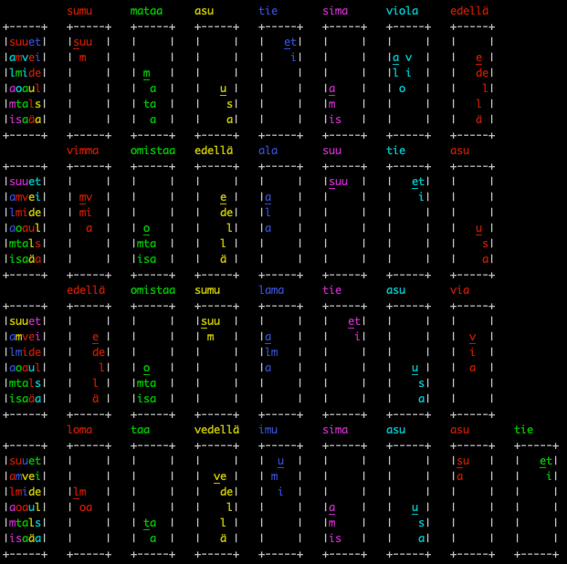

# HS Sanalouhos solver

This is my solver for solving the Helsingin Sanomat sanalouhos puzzle. 

Originally it was a simple python script, but later I ported it to a javascript app.

Works by randomly selecting words until the correct solution is found. Has some clever optimization tricks. Basic idea is:

 1. Find all possible words with their positions from the grid
 * For all possible word, find a list of all the words that can be placed with this word
 * Select a random word with its list of words that can be used with that word
 * Use a set intersection operation to find the still possible words
 * Repeat until no more words can be placed
 * Repeat from step 3 until a solution is found

Since the set intersection is somewhat fast to calculation, this works fast enough to find the solution in a reasonable time.

Requires `nykysuomensanalista2024.csv` file to be in the same directory as the script. Can be downloaded from https://www.kotus.fi/aineistot/sana-aineistot/nykysuomen_sanalista

## Python version:

Input the string to the source code and run the script. The script will output the words in the solution.

Tested on python 3.12. No other requirements.

Prints out all the possible solutions it finds:

## JavaScript version:

Has a simple UI to input the grid and see the solution:

